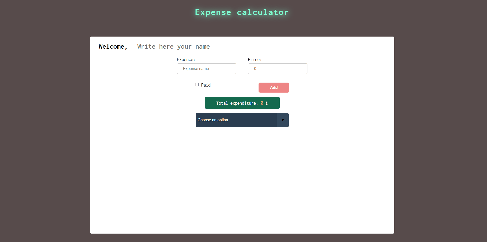

# Expense-App

<h3>Used programs:</h3>

 - HTML

 - CSS

 - JavaScript

<h3>Description:</h3>

In this App, you can write at the top of the page whom the expenses belong to; you can save or delete your expenses. You can also mark paid or unpaid while saving, and you can change their payment status after saving. You can track the total expenses as you add and delete them. And with Select, you can list all expenses, paid expenses and unpaid expenses separately. 

<h3>Screen preview</h3>

Enjoy coding !!!
